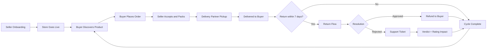
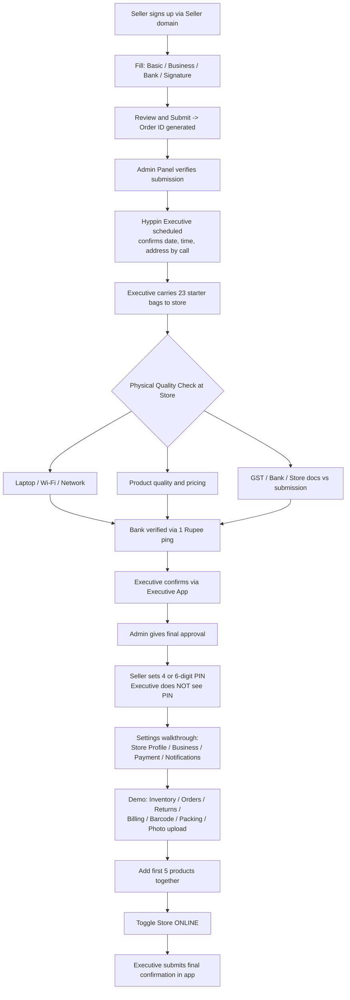
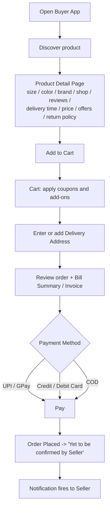
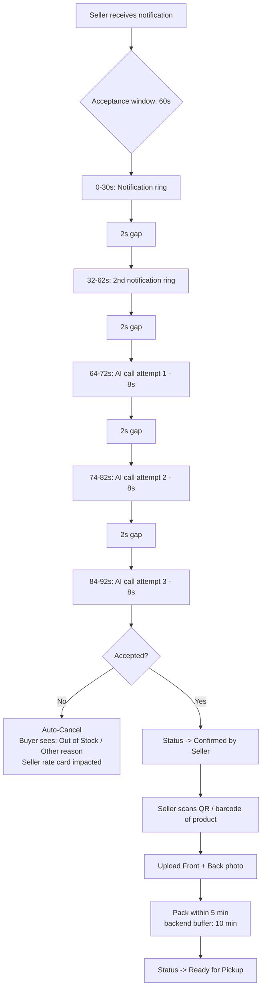
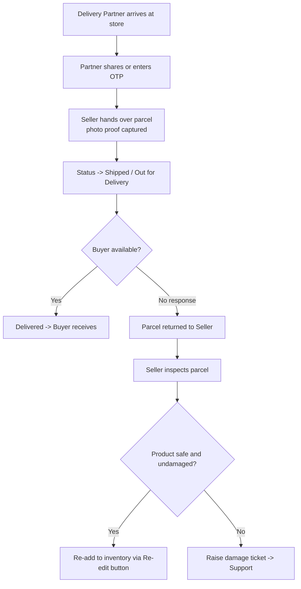
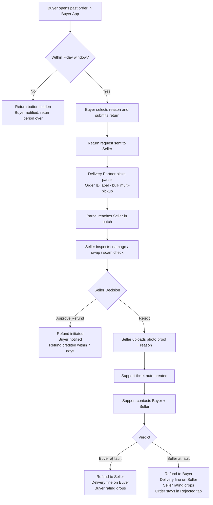
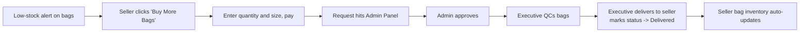
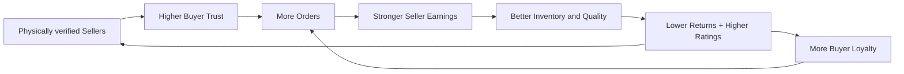

# Hyppin — The Complete Business Cycle

> A strategic, end-to-end map of how value flows between Buyers, Sellers, Delivery Partners, Hyppin Executives, the Admin Panel, and Support — built so anyone can understand Hyppin in 60 seconds and any new team member can ship in week one.

---

## 1. Executive Snapshot

Hyppin is a **hyperlocal commerce platform** that connects **Buyers** with **physically-verified Sellers** through three integrated apps — **Buyer App**, **Seller App**, and **Executive/Admin App** — supported by a **Delivery Partner** network and a **Support layer**.

Hyppin's edge is **trust by design**:
- Every seller is **physically onboarded** by a Hyppin executive.
- Every order has a **60-second acceptance SLA** enforced by AI calling.
- Every pickup is **OTP + photo-proof** secured.
- Every return is governed by a **7-day, rating-backed resolution engine**.

---

## 2. The Hyppin Cycle at a Glance

---

## 3. Phase 1 — Seller Onboarding & Activation

> "We don't just verify documents. We walk into the shop."

**Why this matters:** the PIN-lock replaces OTP friction, the physical visit eliminates fake sellers, and the 5-product live-add ensures the seller can actually operate before going live.

---

## 4. Phase 2 — Buyer Discovery → Order Placement

**Buyer-side status ladder:**
`Order Placed` → `Confirmed by Seller` → `Yet to be Shipped` → `Shipped / Out for Delivery` → `Delivered` → *(optional)* `Returned`

---

## 5. Phase 3 — Seller Order Acceptance & Packing

> The 60-second acceptance window is Hyppin's promise to the buyer.

---

## 6. Phase 4 — Delivery Handover

---

## 7. Phase 5 — Returns & Refund Resolution (The Trust Engine)

---

## 8. Supporting Loop — Packaging Bag Refill

---

## 9. The Trust & Safety Decision Matrix

| Scenario | Refund goes to | Rating impact | Delivery fine |
|---|---|---|---|
| Seller approves return | **Buyer** | None | None |
| Seller rejects → Buyer at fault (false claim, used item, scam) | **Seller** | Buyer ↓ | Buyer pays |
| Seller rejects → Seller at fault (damage, swap, low quality) | **Buyer** | Seller ↓ | Seller pays |
| Buyer not available at delivery | N/A (parcel returns) | Buyer ↓ (repeat offences) | Buyer pays |
| Seller misses 60s acceptance | N/A (auto-cancel) | Seller ↓ | None |

---

## 10. Return Eligibility Triggers

A buyer can request a return for any of these reasons (within the 7-day window for Fashion / Footwear / Watches):

1. No response from buyer when the delivery partner reaches the address
2. Damage to the product
3. Size or color issue
4. Quality issue

---

## 11. Roles at a Glance

| Actor | Core Responsibilities |
|---|---|
| **Buyer** | Discover, order, pay, receive, optionally return within 7 days |
| **Seller** | Accept orders in ≤60s, scan + photograph, pack ≤5min, manage inventory, handle returns, refill bags |
| **Delivery Partner** | OTP-based pickup, photo proof, deliver, multi-batch return pickup |
| **Hyppin Executive** | Onboard sellers, physical QC, demo, bag delivery, app-based confirmations |
| **Admin Panel** | Verify onboarding, approve activations, approve bag refills, oversee tickets |
| **Support Team** | Mediate disputes, raise IT tickets, decide refund verdicts |

---

## 12. The One-Line Pitch

> **Hyppin verifies sellers physically, lets buyers shop hyperlocal in seconds, enforces a 60-second order acceptance, OTP-secured pickup, photo-proof packing, and a rating-backed 7-day return engine — so trust is built into every step of the cycle.**

---

## 13. The Hyppin Flywheel — Why It Compounds

Every loop in this document feeds the flywheel: faster onboarding adds verified sellers, the 60-second SLA drives buyer trust, the photo-proof + OTP system reduces disputes, and the rating-backed resolution engine punishes bad actors and rewards good ones — making the next cycle smoother than the last.
